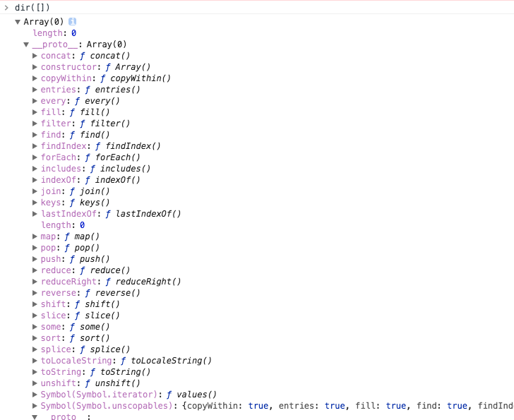

# Array

`Array` 方法比较多，而且使用频繁。必须全部背下来。




## push() pop() shift() unshift()

这四个方法很常用，主要用于向数组的前后添加或删除一项。会改变原数组。

- `push()`：返回 `push()` 后新数组的长度。
- `pop()`：返回被移除的一项
- `shift()`：返回被移除的一项
- `unshift()`：返回 `unshift()` 后新数组的长度。
```
var a = [1, 2, 3, 4]
a.push() // 数组不变
a.push(5, 6, 7)  // 返回长度7，a = [1,2,3,4,5,6,7]

a.unshift('a', 'b', 'c')  // a = ['a,','b','c',1,2...]
```


## concat()

`concat()` 用于将其它数组与原数组合并，不会改变原数组，返回一个新数组。`concat()` 的参数可以是任意数据形式。

```
var a = [1]
a.concat()        // [1]
a.concat(2, {}, null)   // [1, 2, {}, null]
var b = ['e']
var c = ['d']
a.concat(b, c)   // [1, 'e', 'd']
```

`concat()` 会将原数组的项和新项目(新数组的项目，或直接项目)合并后，返回新数组。

## copyWithin()
## entries()
## find() findIndex() indexOf() lastIndexOf() includes()
## join()

`join()` 用于数组的元素拼接成字符串，默认用逗号拼接。

```
var a = ['a', 'b', 'c'];
a.join()     // 'a,b,c'
a.join('-')  // 'a-b-c'
```

## keys()

## forEach() map() every() filter() fill() some()

`forEach()`, `map()` 都可以对数组进行遍历。区别是前者没有返回值，后者会将每个元素处理后返回一个新数组。

```
var a = [1, 2]
a.forEach(function(){})  // undefined
a.map(function(){})      // 返回值：[undefined, undefined]
```

`every()` 如果所有元素都满足要求，则返回true，否则返回 false
`some()`  如果有元素满足要求，则返回true，否则返回false
`filter()` 用于过滤元素

`fill()` 方法用一个固定值填充一个数组中从起始索引到终止索引内的全部元素。

```
// 语法
arr.fill(value [, start, end])  要填充的元素是 [start, end)

// 实例
var a = [1, 2, 3, 4]

var b = a.fill('a', 1, 2) 
console.log(a, b)    // [1, "a", 3, 4]  [1, "a", 3, 4]

a.fill('a', 1, 1)   // [1, 2, 3, 4]
a.fill('a', 1, -2)  // [1, 'a', 3, 4]
```

- 如果end是负数，则从倒数开始计数，如果 start 和 - end是同一个元素 ，则 start会被填充，如果start，end交集为空，则没有元素选中
- 如果start是负数，则从倒数开始计数，如果start、end都是负数，则没有元素被填充
- 如果start是正数，start == end，则没有元素被填充
- 关于undefined、null、NaN
    - null,null/NaN 没有元素选中
    - null,undefined 都被选中
    - NaN,undefined 都被选中
    - NaN,null/NaN  没有选中
    - undefined,undefined 都选中
    - undefined,null/NaN 没有选中

## reduce() reduceRight()
## reverse()

将数组反转顺序。

## slice()

返回一个从开始到结束(不包括结束)选择的数组的一部分浅拷贝到一个新数组对象。不改变原数组。

```
// 语法
slice(start, end)
```
- start 为负数，则是倒数第几个元素到末尾
- end 如果是负数，则是start到end，如果end 大于数组长度，则会一直到数组末尾。

**将类数组转为数组**

```
[].slice.call(arguments)

// 或者
var slice = Function.prototype.call.bind(Array.prototype.slice)
slice(arguments)
```

## sort()

对数组进行排序。

## splice()
## toLocaleString()
## toString()


