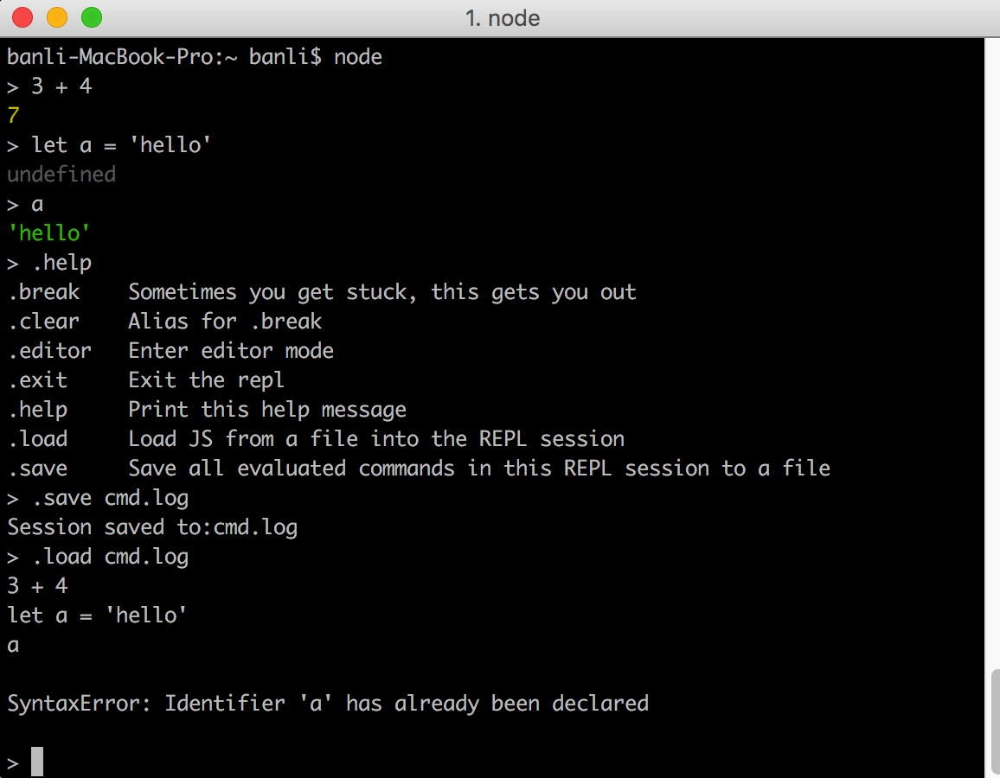

# REPL交互环境

REPL是Read Eval Print Loop的简称，它是一个终端环境，相当于浏览器的控制台一样。

通过在终端运行`node`命令，进入node的执行环境。
- 下划线`-` 可以获取上一个表达式运算结果
- .help 可以查看可以使用的方法
- .save 1.txt 可以将执行的代码保存成文件
- .load 1.txt 下次可以通过这种方式加载文件
- .exit 退出repl环境
- .editor 进入编辑模式
- .break  有时候卡住了，可以通过这个命令退出
- .clear  是.break的别名