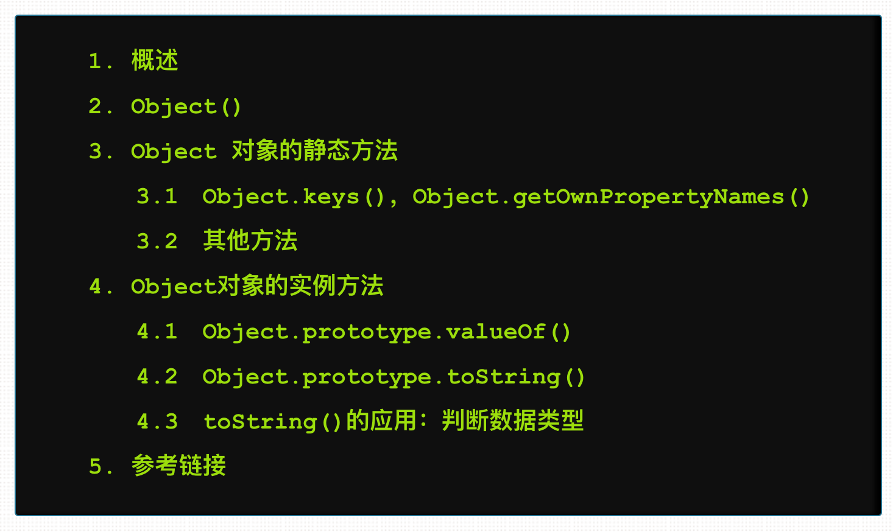

# css计数器

看到阮一峰的(javascript标准参考教材](http://javascript.ruanyifeng.com/stdlib/object.html) 的目录部分的序号列表，突然想知道它是如何实现的呢。



这种toc导航在很多博客上很常见，但是之前一直没当回事。

## 基础

css计数器需要和`:before`或`:after`的`content`属性混合使用才会有效果。

```
<ol>
    <li>a</li>
    <li>b</li>
</ol>
```

拿上面结构来说。可以设置：

```
ol{
    counter-reset: section;
}
ol li:before{
    counter-increment: section;
    content: counter(section) ':';
}
```

`counter-reset: section`可以生成一个名叫`section`的计数器实例，它还可以加一个初始化值，`counter-reset:section 1`表示计数器从1开始计数`。

`counter-increment: section` 表示实例计数增加1，当前的数可以通过 `counter(section)`获取到。

## 计数器嵌套

来看看下面的代码

```
<ol>
    <li>
        <ol>
            <li>1</li>
            <li>2</li>
        </ol>
    </li>
    <li>b</li>
</ol>
```

像上面的嵌套结构，需要使用`counters(实例名, '')` 方法来获取嵌套的计数器，第二个参数必须填写，表示实例之间的连接符。