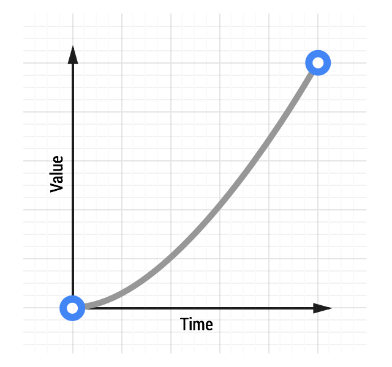
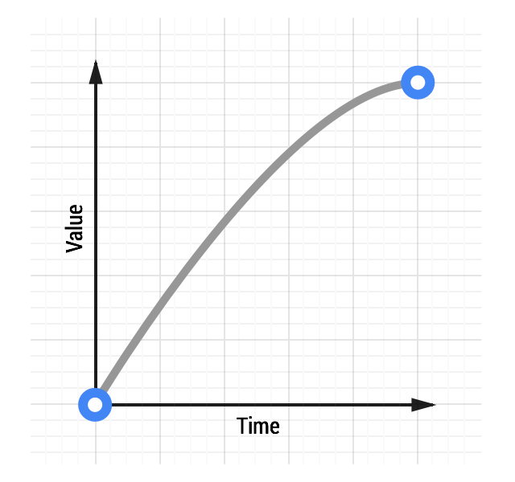
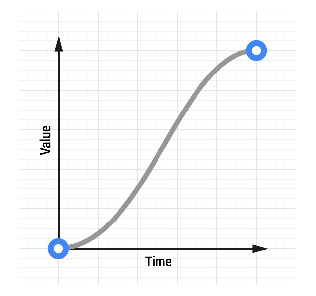

# 如何做一个动画(上)

## 动画的形式

动画的形式有三种：

1. 逐帧动画：利用人眼的视觉暂留，一秒钟放24张图片，人眼就感觉不到图片切换之间的空隙了。
2. 形状变形：比如方形变圆形。
3. 运动变形：物体自身的变化，比如移动、缩放、旋转、改变透明度。

我们先只讨论运动变形动画。

## 动画的一些参数

试想一下，我们要做一个运动变形动画需要知道哪些条件?

物体的起始状态、终点状态、中间状态、经历了多长时间、缓动函数(运动快慢)、运动的路径等。


## 我的动画史

最初我们是通过flash来制作动画，很多年前也会一点点，现在都忘记了。后来是通过js定时器来做动画(如旧版jquery)，再后来是css3(比如animation.css)。

js定时器做动画、css的transition、animation这些，我都特意学过。看了下animation.css的代码，也都能够看懂。但是动画的应用却很缺乏，对一个页面不知道哪里应该加动画，怎么加动画，我争取通过这一专题，来解决这个问题。

## css3动画

css3新增了两个属性：transition和animation。

### transition过渡

transition是过渡。可以控制元素从某个状态自然过渡到另一状态。

```
div {
    width: 100px;
    height:100px;
    background: red;
    transition: 1s all ease
}
div:hover{
    width: 150px;
    height: 150px;
    background: blue;
}
```

上面的代码，当鼠标放在盒子上时，盒子会自然的放大和变色。这种设置一个起点和终点，浏览器自动补齐中间状态的动画，也叫补间动画。

`transition` 是几个属性的集合：

- `transition-property`：设置哪些属性会过渡，多个属性用逗号分隔，省略不写就默认是`all`，表示全部。
- `transition-duration`：设置过渡的时间
- `transition-delay`： 延迟多长时间开始过渡
- `transition-timing-function`： 缓动函数，即描述物体快慢的函数
    - `ease`： 慢快慢
    - `linear`：匀速
    - `ease-in`：加速
    - `ease-out`：减速
    - `ease-in-out`：先加速再减速
    - `cubic-bezier(n, n, n, n)`：贝塞尔曲线，n 在 0-1 之间。我们可以通过这种方式自定义缓动函数。

这里有3个问题：

1. 哪些属性可以过渡？
2. 过渡的时间、延迟的时间，这两个值写的时候顺序是怎么样的？
3. 缓动函数到底是什么？

接下来一一介绍。

## 哪些属性可以过渡?

## 过渡和延迟时间的编写顺序问题?

## 缓动函数到底是什么

自然界中，物体通常都不是匀速运动的，而是会加速和减速。所以利用这种规律做出自然的运动，会产生更好的用户体验。

缓动函数的原则：

1. 缓动使动画感觉更自然
2. 为UI元素选择缓出动画
3. 避免缓入或缓入缓出动画，除非很短，这类动画会让用户觉得迟钝。

缓入(慢入)即先慢后快；缓出(慢出)即先快后慢。

**缓动关键字**

css变换和动画都可以给动画使用缓动函数(timing)，也可以自定义缓动函数。

css中可以使用的关键词有：`linear`、`ease-in`、`ease-out`、`ease-in-out`。资料来源：[css变换，W3C](https://www.w3.org/TR/css-transitions-1/#transition-timing-function-property)。

还可以使用 steps 关键字，它可以用来创建逐帧动画，后面再讲。先来看看缓动函数曲线。

- linear: 线性动画，也叫匀速动画

- ease-in: 缓入动画，先慢后快

- ease-out: 缓出动画，先快后慢

- ease-in-out: 缓入缓出动画，先慢在快后慢


上面缓动函数结合图片来看是很简单的。我们可以通过它来控制物体的快慢变化。

如果要自定义缓动动画，下面这几个网站会有帮助：

- http://easings.net/zh-cn  引入后，可以直接使用
- http://cubic-bezier.com/  用来生成bezier曲线函数

关于js的缓动函数，可以参考GreenSock 的 TweenMax（或 TweenLite，如果您想要超轻量版本）是一个强大的框架，您可以在小型 JavaScript 库中获得很多控制，它是一个非常成熟的代码库。有大量缓动选项可供使用。[TweenMax 文档](https://greensock.com/docs/#/HTML5/GSAP/TweenMax/)

### animation动画

上面的transition只能设置起始状态和终点状态，我们不能控制中间的状态。而animation可以让我们增加中间状态。它的定义语法如下：

```
// 定义一个动画，名字叫fade-in
@keyframes fade-in{
    0{opacity:0}
    20%{opacity:0.2}
    50%{opacity:0.8}
    100%{opacity:1}
}

// 使用它
div{
    animation: fade-in 1s
}
```

上面首先定义了一个叫fade-in的动画，设置了四个帧，然后div使用了它。浏览器同样会补齐这四帧的中间状态。

`animation` 是下面几个属性的简写：

- `animation-name`：动画的名字
- `animation-duration`：动画的事件
- `animation-delay`：延迟多长时间开始动画
- `animation-timing-function`：缓动函数
- `animation-iteration-count`：动画的重复次数
- `animation-direction`：动画的方向，是正向运动还是反向运动。
- `animation-play-state`：
- `animation-fill-mode`: 
    - 默认值是`none`，结束时停留在元素默认原始位置。
    - 当值设置为 `forwards` 时，动画执行完后会停在 animation 最后一帧的位置上。
    - 当值设置为 `backwards` 时，如果设置了delay，元素刚开始动画前，会停留在 0% 第一帧的位置。否则是停留在元素默认位置。
    - `both`

如果动画没有设置最后一帧，则最后一帧为元素的默认位置，而不是0%处。


## 常见的css动画库

- https://github.com/daneden/animate.css
- https://github.com/miniMAC/magic
- https://github.com/IanLunn/Hover
- https://github.com/h5bp/Effeckt.css
- https://github.com/lukehaas/css-loader

## js动画基础

js动画最初是用定时器来做，后来是通过控制css3来做，再后来原生js推出了webAnimationAPI。接下来依次讲解。

前端制作动画主要有下面几种方式：

1. css3过渡和动画
2. javascript动画
3. svg动画
4. gif动画


## css对比javascript动画


## 视图切换动画

## 选择合适的缓动

- 为 UI 元素使用缓出动画；Quintic 缓出是一个非常好（虽然比较快速）的缓动。
- 一定要使用动画持续时间；缓出和缓入应为 200 毫秒 - 500 毫秒，而弹跳和弹性缓动的持续时间应更长，为 800 毫秒 - 1200 毫秒。

一般来说，缓出将是正确的选择，当然也是很好的默认选择。它开头较快，使动画有反应快速的感觉，这一点很受欢迎，但在结尾有一个不错的减速。

其他缓动公式应谨慎使用，特别是弹跳或弹性缓动，并且仅在适合于项目时才使用。很少有东西会像不协调的动画那样让用户体验很差。如果您的项目不是为了追求乐趣，那么就无需使元素在 UI 周围进行弹跳。相反，如果您将要创建一个轻松欢乐的网站，那么请务必使用弹跳！

关于缓动类型的完整列表及其演示，请参阅 [easings.net](http://easings.net/zh-cn#)

给项目添加的任何动画均须有正确的持续时间。若太短，动画让人感觉有攻击性和突然；若太长，则让人觉得很卡和讨厌。

缓出：约 200 毫秒 - 500 毫秒。这让眼睛有机会看到动画，但不会觉得卡顿。
缓入：约 200 毫秒 - 500 毫秒。请记住，它在结尾将晃动，没有时间量变化将缓和这种影响。
弹跳或弹性效果：约 800 毫秒 - 1200 毫秒。您需要留出时间让弹性或弹跳效果“停下”。若没有这点额外时间，动画的弹性跳动部分看上去比较有攻击性，让人感觉不舒服。

## 给模态框设置动画

模态视图用于重要消息，并且您有很好的理由来阻止用户界面。应谨慎使用模态视图，因为它们具有破坏性，如果过度使用，会很容易破坏用户体验。但是，在某些情况下，它们是适合使用的视图，并且加上一些动画将使其变得生动。

- 应谨慎使用模态视图；如果不必要地打断用户的体验，他们会感到失望。
- 给动画加上缩放可实现不错的“掉落”效果。
- 当用户关闭模态视图时，应迅速将其清除。但是，应让模态视图以较慢的速度进入屏幕，以防使用户感到突然。

不对称的动画定时

一般的经验法则为：

对于用户交互触发的 UI 动画，例如视图变换或显示元素，采用快速前奏（短持续时间）和慢速结尾（较长持续时间）。
对于由代码触发的 UI 动画，例如错误或模态视图，采用较慢前奏（较长持续时间）和快速结尾（短持续时间）。

## 动画与性能
在设置动画时应保持 60fps，因为任何卡顿或停顿都会引起用户注意，并对其体验产生负面影响。


注意您的动画不能导致性能问题；确保了解对指定 CSS 属性设置动画的影响。
改变页面（布局）结构或导致绘图的动画属性特别消耗资源。
尽可能坚持改变变形和透明度。
使用 will-change 来确保浏览器知道您打算对什么设置动画。

应尽可能避免给触发布局或绘制的属性设置动画。对于大部分现代浏览器，这意味着将动画限制为 opacity 或 transform，两种都可经浏览器高度优化；动画是由 JavaScript 还是由 CSS 处理并不重要。


使用 will-change 属性
使用 will-change 来确保浏览器知道您打算改变元素的属性。这使浏览器能够在您做出更改之前进行最合适的优化。但是，请勿过度使用 will-change，因为过度使用可能导致浏览器浪费资源，进而引起其他性能问题。

一般经验法则是，如果动画可能在接下来的 200 毫秒内触发（由用户交互触发或由应用的状态触发），则对动画元素使用 will-change 是个好主意。对于大多数情况，在应用的当前视图中您打算设置动画的任何元素都应启用 will-change，无论您打算改变哪个属性。在我们在之前的指南中一直使用的方框示例中，为变形和透明度加上 will-change 属性将产生如下结果：

.box {
  will-change: transform, opacity;
}
现在支持此属性的浏览器有 Chrome、Firefox 和 Opera，这些浏览器将在后台进行相应的优化，以支持这些属性的更改或动画设置。


CSS 对比 JavaScript 的性能
网络上有很多网页和评论从性能的角度讨论了 CSS 和 JavaScript 动画的相对优点。以下是要记住的几个要点：

基于 CSS 的动画以及原生支持的网络动画通常由一个名为“合成器线程”的线程处理。这不同于在其中执行样式、布局、绘制和 JavaScript 的浏览器“主线程”。这意味着，如果浏览器正在主线程上运行一些高开销任务，则这些动画可以继续运行而不中断。

在许多情况下，变形和透明度的其他更改还可由合成器线程来处理。

如果任何动画触发绘制、布局或同时触发这两者，则“主线程”将必须执行工作。这点同时适用于基于 CSS 和 JavaScript 的动画，并且布局或绘制的开销可能拖慢与 CSS 或 JavaScript 执行相关的任何工作，使问题变得无意义。

有关对指定的属性设置动画会触发哪个动作的详细信息，请参阅 [CSS 触发器](https://csstriggers.com/)。


## 参考文章

- [深入理解CSS3 Animation 帧动画](http://www.cnblogs.com/aaronjs/p/4642015.html)
- [CSS3制作Loading动画](http://www.alloyteam.com/page/2/?s=%E5%8A%A8%E7%94%BB)
- [JavaScript定时器与执行机制解析](http://www.alloyteam.com/2016/05/javascript-timer/)
- [CSS3 Transform的perspective属性](http://www.alloyteam.com/2012/10/the-css3-transform-perspective-property/)
- [CSS3 的 roate 与 rotateX 的顺序研究](http://www.alloyteam.com/2012/11/the-order-of-roate-with-rotatex-problem/)
- [聊聊移动端跨平台开发的各种技术](http://fex.baidu.com/blog/2015/05/cross-mobile/)
- [H5动画：轨迹移动](https://aotu.io/notes/2017/11/06/path-animation/index.html)
- [css3 animation 属性众妙](https://aotu.io/notes/2016/11/28/css3-animation-properties/)
- [CSS3动画之3D动画](https://aotu.io/notes/2016/05/06/CSS3-3D-Animation/)
- [CSS3动画之补间动画](https://aotu.io/notes/2016/05/06/Guide-To-Tween-Animation)
- [CSS3动画实践](https://aotu.io/notes/2016/01/04/css3-animation/)
- [腾讯干货！由浅入深科普最常用的八种Html 5动效制作手法](http://www.uisdc.com/8-html5-animation-method)
- [CSS3动画之逐帧动画](https://aotu.io/notes/2016/05/17/css3-animation-frame/)
- [[转载]网页动画的十二原则](https://www.w3cplus.com/css3/animation-principles-for-the-web.html)
- [csstriggers](https://csstriggers.com/)
- [谷歌开发者动画手册(要翻墙)](https://developers.google.com/web/fundamentals/design-and-ux/animations/?hl=zh-cn)
- [完整的学习和使用 CSS 动画【翻译】](https://juejin.im/entry/58b25367ac502e006ca11b59)
- [快速制作高性能帧动画解决方案](http://www.alloyteam.com/2017/08/gka3/)
- [实例CSS3开场动画的制作与优化](http://www.alloyteam.com/2016/01/css3995527/)
- [使用 gka 一键生成帧动画](http://www.alloyteam.com/2017/07/gka/)
- [gif的故事：解剖表情动图的构成](http://www.alloyteam.com/2017/09/13121/)
- [【福利】乳摇动画初探](http://www.alloyteam.com/2015/08/fu-li-ru-yao-dong-hua-chu-tan/)
- [前端福利！10个免费好用功能强大的网页动画效果库](https://news.aotu.io/a/5a69a3b51b69e6003c2dda39)
- [H5动画60fps之路](https://weibo.com/p/1001603865643593165786)
- [High Performance Animations](https://www.html5rocks.com/zh/tutorials/speed/high-performance-animations/)
- [一篇文章说清浏览器解析和CSS（GPU）动画优化](https://segmentfault.com/a/1190000008015671)
- [使用 FLIP 来提高 Web 动画的性能](http://bubkoo.com/2016/03/31/high-performance-animations/)
- [CSS动画简介](http://www.ruanyifeng.com/blog/2014/02/css_transition_and_animation.html)
- [FLIP Your Animations](https://aerotwist.com/blog/flip-your-animations/)
- [Web Animations API polyfill](https://github.com/web-animations/web-animations-js)
- [flipjs](https://github.com/googlearchive/flipjs)
- [Boost Your CSS Animation Performance with the Repaintless.css Library](http://blog.lunarlogic.io/2016/boost-your-css-animation-performance-with-repaintless-css/)
- [Repaintless.css](https://github.com/szynszyliszys/repaintless)
- [JS动画效果](https://www.imooc.com/learn/167)
- [原生 JS 实现帧动画库](https://www.imooc.com/learn/659)
- [数学知识在CSS动画中的应用](https://www.imooc.com/learn/362)
- [CSS3的3D变换和动画](http://imweb.io/topic/556bb6f173956de01fad07f8)
- [animation动画实践](http://imweb.io/topic/55bb5e50193684376cd08b44)
- [搞定这些疑难杂症，向css3动画说yes](http://imweb.io/topic/5643850eed18cc424277050e)
- [浅谈前端动画](http://uedfamily.com/2017/04/09/genffy/fe-animation/)
- [骨骼动画原理与前端实现浅谈](http://taobaofed.org/blog/2015/11/30/animation-bone/)
- [Web Animations](https://drafts.csswg.org/web-animations/)
- [CSS Transitions](https://www.w3.org/TR/css-transitions-1/#transition-timing-function-property)
- [SVG 动画精髓](https://www.villainhr.com/page/2017/05/01/SVG%20%E5%8A%A8%E7%94%BB%E7%B2%BE%E9%AB%93)
- [H5动画开发快车道](http://djt.qq.com/article/view/1527)
- [玩转HTML5移动页面(动效篇)](http://djt.qq.com/article/view/1400)
- [玩转HTML5移动页面(优化篇)](http://djt.qq.com/article/view/1402)
- [touches详解](https://segmentfault.com/q/1010000002870710)