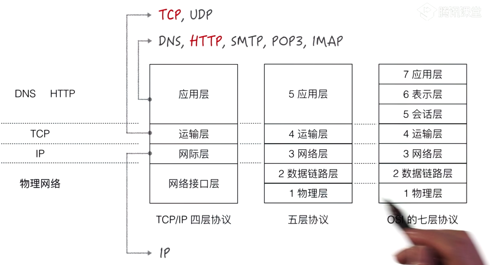
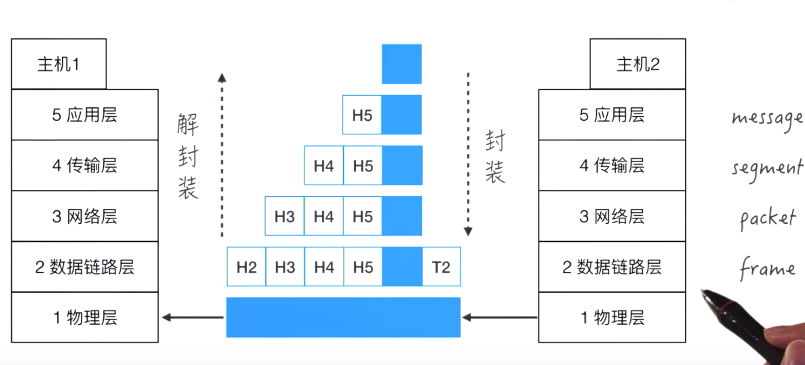

# 输入地址后发生了什么

客户端输入网址 -DNS-> IP地址 -> 打包(HTTP) -> 逻辑网络(TCP/IP) -> 物理网络 -> 逻辑网络(TCP/IP) -> 拆包(HTTP) -> 服务端

## 7层协议

应用层
传输层

物理层

## 数据传输

## tcp 和 udp

- tcp简介
- tcp数据包大小
- tcp数据包编号SEQ
- TCP数据包组装
- 慢启动和 ACK
- 数据包的遗失处理

tcp和udp属于传输层协议，tcp全称是`transport control protrol`，它的作用是保证数据通信的完整性和可靠性，防止丢包。

### 创建连接

简单说，让双方都证实对方能发收。 知道对方能收是因为收到对方的因为收到而发的回应。
1：A发，B收， B知道A能发
2：B发，A收， A知道B能发收
3：A发，B收， B知道A能收

### 传输数据

### 关闭连接

以太网数据包的大小是固定的，是1522字节，其中1500字节是负载，22字节是头信息。

## 参考资料

- [HTTP1.1与前端性能](http://imweb.io/topic/554c5879718ba1240cc1dd8a)
- [TCP/IP模型的一个简单解释](http://www.ruanyifeng.com/blog/2009/03/tcp-ip_model.html)
- [当···时发生了什么？](https://github.com/skyline75489/what-happens-when-zh_CN#g)
- [从输入 URL 到页面加载完成的过程中都发生了什么事情？](http://fex.baidu.com/blog/2014/05/what-happen/)
- [What really happens when you navigate to a URL](http://igoro.com/archive/what-really-happens-when-you-navigate-to-a-url/)
- [TCP协议详解](https://www.jianshu.com/p/ef892323e68f)
- [TCP 协议简介](http://www.ruanyifeng.com/blog/2017/06/tcp-protocol.html)
- [HTTP 协议入门](http://www.ruanyifeng.com/blog/2016/08/http.html)
- [互联网协议入门（一）](http://www.ruanyifeng.com/blog/2012/05/internet_protocol_suite_part_i.html)
- [互联网协议入门（二）](http://www.ruanyifeng.com/blog/2012/06/internet_protocol_suite_part_ii.html)